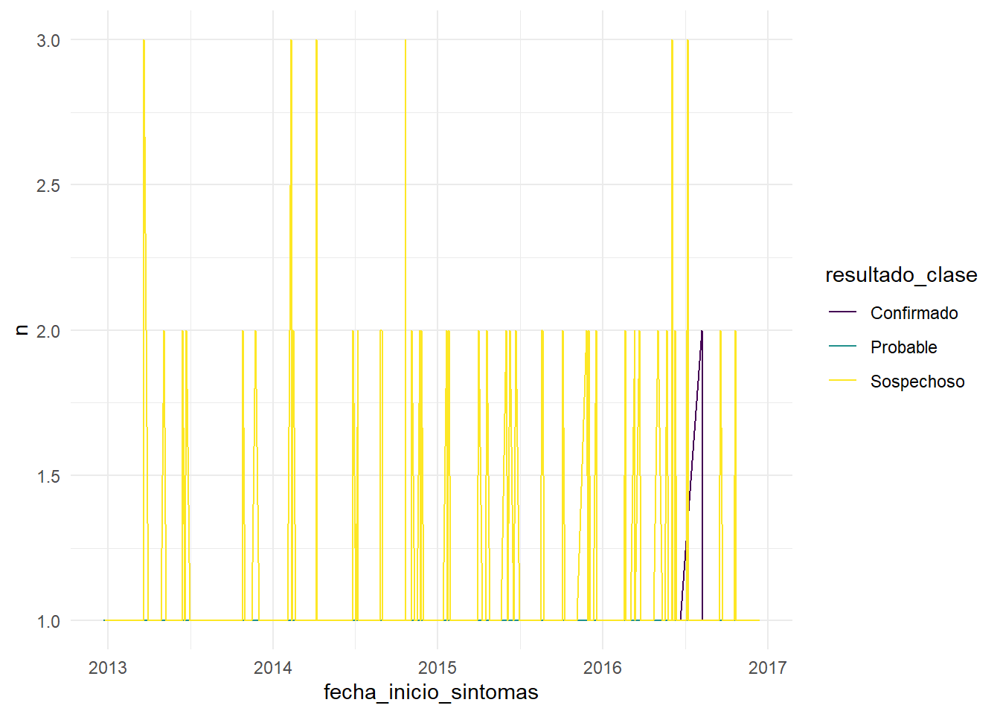

[Este material es parte del curso **Introducción a R *tidyverse* del Instituto Nacional de Epidemiología “Dr. Juan H. Jara” - ANLIS**]{.text style="display: block; text-align: center;"}

[Creado por Tamara Ricardo, licensed under [CC BY-NC 4.0](#0) ![](data:image/svg+xml;base64,PD94bWwgdmVyc2lvbj0iMS4wIiBlbmNvZGluZz0idXRmLTgiPz4NCjwhLS0gR2VuZXJhdG9yOiBBZG9iZSBJbGx1c3RyYXRvciAxMy4wLjIsIFNWRyBFeHBvcnQgUGx1Zy1JbiAuIFNWRyBWZXJzaW9uOiA2LjAwIEJ1aWxkIDE0OTQ4KSAgLS0+DQo8IURPQ1RZUEUgc3ZnIFBVQkxJQyAiLS8vVzNDLy9EVEQgU1ZHIDEuMC8vRU4iICJodHRwOi8vd3d3LnczLm9yZy9UUi8yMDAxL1JFQy1TVkctMjAwMTA5MDQvRFREL3N2ZzEwLmR0ZCI+DQo8c3ZnIHZlcnNpb249IjEuMCIgaWQ9IkxheWVyXzEiIHhtbG5zPSJodHRwOi8vd3d3LnczLm9yZy8yMDAwL3N2ZyIgeG1sbnM6eGxpbms9Imh0dHA6Ly93d3cudzMub3JnLzE5OTkveGxpbmsiIHg9IjBweCIgeT0iMHB4Ig0KCSB3aWR0aD0iNjRweCIgaGVpZ2h0PSI2NHB4IiB2aWV3Qm94PSI1LjUgLTMuNSA2NCA2NCIgZW5hYmxlLWJhY2tncm91bmQ9Im5ldyA1LjUgLTMuNSA2NCA2NCIgeG1sOnNwYWNlPSJwcmVzZXJ2ZSI+DQo8Zz4NCgk8Y2lyY2xlIGZpbGw9IiNGRkZGRkYiIGN4PSIzNy43ODUiIGN5PSIyOC41MDEiIHI9IjI4LjgzNiIvPg0KCTxwYXRoIGQ9Ik0zNy40NDEtMy41YzguOTUxLDAsMTYuNTcyLDMuMTI1LDIyLjg1Nyw5LjM3MmMzLjAwOCwzLjAwOSw1LjI5NSw2LjQ0OCw2Ljg1NywxMC4zMTQNCgkJYzEuNTYxLDMuODY3LDIuMzQ0LDcuOTcxLDIuMzQ0LDEyLjMxNGMwLDQuMzgxLTAuNzczLDguNDg2LTIuMzE0LDEyLjMxM2MtMS41NDMsMy44MjgtMy44Miw3LjIxLTYuODI4LDEwLjE0Mw0KCQljLTMuMTIzLDMuMDg1LTYuNjY2LDUuNDQ4LTEwLjYyOSw3LjA4NmMtMy45NjEsMS42MzgtOC4wNTcsMi40NTctMTIuMjg1LDIuNDU3cy04LjI3Ni0wLjgwOC0xMi4xNDMtMi40MjkNCgkJYy0zLjg2Ni0xLjYxOC03LjMzMy0zLjk2MS0xMC40LTcuMDI3Yy0zLjA2Ny0zLjA2Ni01LjQtNi41MjQtNy0xMC4zNzJTNS41LDMyLjc2Nyw1LjUsMjguNWMwLTQuMjI5LDAuODA5LTguMjk1LDIuNDI4LTEyLjINCgkJYzEuNjE5LTMuOTA1LDMuOTcyLTcuNCw3LjA1Ny0xMC40ODZDMjEuMDgtMC4zOTQsMjguNTY1LTMuNSwzNy40NDEtMy41eiBNMzcuNTU3LDIuMjcyYy03LjMxNCwwLTEzLjQ2NywyLjU1My0xOC40NTgsNy42NTcNCgkJYy0yLjUxNSwyLjU1My00LjQ0OCw1LjQxOS01LjgsOC42Yy0xLjM1NCwzLjE4MS0yLjAyOSw2LjUwNS0yLjAyOSw5Ljk3MmMwLDMuNDI5LDAuNjc1LDYuNzM0LDIuMDI5LDkuOTEzDQoJCWMxLjM1MywzLjE4MywzLjI4NSw2LjAyMSw1LjgsOC41MTZjMi41MTQsMi40OTYsNS4zNTEsNC4zOTksOC41MTUsNS43MTVjMy4xNjEsMS4zMTQsNi40NzYsMS45NzEsOS45NDMsMS45NzENCgkJYzMuNDI4LDAsNi43NS0wLjY2NSw5Ljk3My0xLjk5OWMzLjIxOS0xLjMzNSw2LjEyMS0zLjI1Nyw4LjcxMy01Ljc3MWM0Ljk5LTQuODc2LDcuNDg0LTEwLjk5LDcuNDg0LTE4LjM0NA0KCQljMC0zLjU0My0wLjY0OC02Ljg5NS0xLjk0My0xMC4wNTdjLTEuMjkzLTMuMTYyLTMuMTgtNS45OC01LjY1NC04LjQ1OEM1MC45ODQsNC44NDQsNDQuNzk1LDIuMjcyLDM3LjU1NywyLjI3MnogTTM3LjE1NiwyMy4xODcNCgkJbC00LjI4NywyLjIyOWMtMC40NTgtMC45NTEtMS4wMTktMS42MTktMS42ODUtMmMtMC42NjctMC4zOC0xLjI4Ni0wLjU3MS0xLjg1OC0wLjU3MWMtMi44NTYsMC00LjI4NiwxLjg4NS00LjI4Niw1LjY1Nw0KCQljMCwxLjcxNCwwLjM2MiwzLjA4NCwxLjA4NSw0LjExM2MwLjcyNCwxLjAyOSwxLjc5MSwxLjU0NCwzLjIwMSwxLjU0NGMxLjg2NywwLDMuMTgxLTAuOTE1LDMuOTQ0LTIuNzQzbDMuOTQyLDINCgkJYy0wLjgzOCwxLjU2My0yLDIuNzkxLTMuNDg2LDMuNjg2Yy0xLjQ4NCwwLjg5Ni0zLjEyMywxLjM0My00LjkxNCwxLjM0M2MtMi44NTcsMC01LjE2My0wLjg3NS02LjkxNS0yLjYyOQ0KCQljLTEuNzUyLTEuNzUyLTIuNjI4LTQuMTktMi42MjgtNy4zMTNjMC0zLjA0OCwwLjg4Ni01LjQ2NiwyLjY1Ny03LjI1N2MxLjc3MS0xLjc5LDQuMDA5LTIuNjg2LDYuNzE1LTIuNjg2DQoJCUMzMi42MDQsMTguNTU4LDM1LjQ0MSwyMC4xMDEsMzcuMTU2LDIzLjE4N3ogTTU1LjYxMywyMy4xODdsLTQuMjI5LDIuMjI5Yy0wLjQ1Ny0wLjk1MS0xLjAyLTEuNjE5LTEuNjg2LTINCgkJYy0wLjY2OC0wLjM4LTEuMzA3LTAuNTcxLTEuOTE0LTAuNTcxYy0yLjg1NywwLTQuMjg3LDEuODg1LTQuMjg3LDUuNjU3YzAsMS43MTQsMC4zNjMsMy4wODQsMS4wODYsNC4xMTMNCgkJYzAuNzIzLDEuMDI5LDEuNzg5LDEuNTQ0LDMuMjAxLDEuNTQ0YzEuODY1LDAsMy4xOC0wLjkxNSwzLjk0MS0yLjc0M2w0LDJjLTAuODc1LDEuNTYzLTIuMDU3LDIuNzkxLTMuNTQxLDMuNjg2DQoJCWMtMS40ODYsMC44OTYtMy4xMDUsMS4zNDMtNC44NTcsMS4zNDNjLTIuODk2LDAtNS4yMDktMC44NzUtNi45NDEtMi42MjljLTEuNzM2LTEuNzUyLTIuNjAyLTQuMTktMi42MDItNy4zMTMNCgkJYzAtMy4wNDgsMC44ODUtNS40NjYsMi42NTgtNy4yNTdjMS43Ny0xLjc5LDQuMDA4LTIuNjg2LDYuNzEzLTIuNjg2QzUxLjExNywxOC41NTgsNTMuOTM4LDIwLjEwMSw1NS42MTMsMjMuMTg3eiIvPg0KPC9nPg0KPC9zdmc+DQo=){width="20"}![](data:image/svg+xml;base64,PD94bWwgdmVyc2lvbj0iMS4wIiBlbmNvZGluZz0idXRmLTgiPz4NCjwhLS0gR2VuZXJhdG9yOiBBZG9iZSBJbGx1c3RyYXRvciAxMy4wLjIsIFNWRyBFeHBvcnQgUGx1Zy1JbiAuIFNWRyBWZXJzaW9uOiA2LjAwIEJ1aWxkIDE0OTQ4KSAgLS0+DQo8IURPQ1RZUEUgc3ZnIFBVQkxJQyAiLS8vVzNDLy9EVEQgU1ZHIDEuMC8vRU4iICJodHRwOi8vd3d3LnczLm9yZy9UUi8yMDAxL1JFQy1TVkctMjAwMTA5MDQvRFREL3N2ZzEwLmR0ZCI+DQo8c3ZnIHZlcnNpb249IjEuMCIgaWQ9IkxheWVyXzEiIHhtbG5zPSJodHRwOi8vd3d3LnczLm9yZy8yMDAwL3N2ZyIgeG1sbnM6eGxpbms9Imh0dHA6Ly93d3cudzMub3JnLzE5OTkveGxpbmsiIHg9IjBweCIgeT0iMHB4Ig0KCSB3aWR0aD0iNjRweCIgaGVpZ2h0PSI2NHB4IiB2aWV3Qm94PSI1LjUgLTMuNSA2NCA2NCIgZW5hYmxlLWJhY2tncm91bmQ9Im5ldyA1LjUgLTMuNSA2NCA2NCIgeG1sOnNwYWNlPSJwcmVzZXJ2ZSI+DQo8Zz4NCgk8Y2lyY2xlIGZpbGw9IiNGRkZGRkYiIGN4PSIzNy42MzciIGN5PSIyOC44MDYiIHI9IjI4LjI3NiIvPg0KCTxnPg0KCQk8cGF0aCBkPSJNMzcuNDQzLTMuNWM4Ljk4OCwwLDE2LjU3LDMuMDg1LDIyLjc0Miw5LjI1N0M2Ni4zOTMsMTEuOTY3LDY5LjUsMTkuNTQ4LDY5LjUsMjguNWMwLDguOTkxLTMuMDQ5LDE2LjQ3Ni05LjE0NSwyMi40NTYNCgkJCUM1My44NzksNTcuMzE5LDQ2LjI0Miw2MC41LDM3LjQ0Myw2MC41Yy04LjY0OSwwLTE2LjE1My0zLjE0NC0yMi41MTQtOS40M0M4LjY0NCw0NC43ODQsNS41LDM3LjI2Miw1LjUsMjguNQ0KCQkJYzAtOC43NjEsMy4xNDQtMTYuMzQyLDkuNDI5LTIyLjc0MkMyMS4xMDEtMC40MTUsMjguNjA0LTMuNSwzNy40NDMtMy41eiBNMzcuNTU3LDIuMjcyYy03LjI3NiwwLTEzLjQyOCwyLjU1My0xOC40NTcsNy42NTcNCgkJCWMtNS4yMiw1LjMzNC03LjgyOSwxMS41MjUtNy44MjksMTguNTcyYzAsNy4wODYsMi41OSwxMy4yMiw3Ljc3LDE4LjM5OGM1LjE4MSw1LjE4MiwxMS4zNTIsNy43NzEsMTguNTE0LDcuNzcxDQoJCQljNy4xMjMsMCwxMy4zMzQtMi42MDcsMTguNjI5LTcuODI4YzUuMDI5LTQuODM4LDcuNTQzLTEwLjk1Miw3LjU0My0xOC4zNDNjMC03LjI3Ni0yLjU1My0xMy40NjUtNy42NTYtMTguNTcxDQoJCQlDNTAuOTY3LDQuODI0LDQ0Ljc5NSwyLjI3MiwzNy41NTcsMi4yNzJ6IE00Ni4xMjksMjAuNTU3djEzLjA4NWgtMy42NTZ2MTUuNTQyaC05Ljk0NFYzMy42NDNoLTMuNjU2VjIwLjU1Nw0KCQkJYzAtMC41NzIsMC4yLTEuMDU3LDAuNTk5LTEuNDU3YzAuNDAxLTAuMzk5LDAuODg3LTAuNiwxLjQ1Ny0wLjZoMTMuMTQ0YzAuNTMzLDAsMS4wMSwwLjIsMS40MjgsMC42DQoJCQlDNDUuOTE4LDE5LjUsNDYuMTI5LDE5Ljk4Niw0Ni4xMjksMjAuNTU3eiBNMzMuMDQyLDEyLjMyOWMwLTMuMDA4LDEuNDg1LTQuNTE0LDQuNDU4LTQuNTE0czQuNDU3LDEuNTA0LDQuNDU3LDQuNTE0DQoJCQljMCwyLjk3MS0xLjQ4Niw0LjQ1Ny00LjQ1Nyw0LjQ1N1MzMy4wNDIsMTUuMywzMy4wNDIsMTIuMzI5eiIvPg0KCTwvZz4NCjwvZz4NCjwvc3ZnPg0K){width="20"}![](data:image/svg+xml;base64,PD94bWwgdmVyc2lvbj0iMS4wIiBlbmNvZGluZz0idXRmLTgiPz4NCjwhLS0gR2VuZXJhdG9yOiBBZG9iZSBJbGx1c3RyYXRvciAxMy4wLjIsIFNWRyBFeHBvcnQgUGx1Zy1JbiAuIFNWRyBWZXJzaW9uOiA2LjAwIEJ1aWxkIDE0OTQ4KSAgLS0+DQo8IURPQ1RZUEUgc3ZnIFBVQkxJQyAiLS8vVzNDLy9EVEQgU1ZHIDEuMC8vRU4iICJodHRwOi8vd3d3LnczLm9yZy9UUi8yMDAxL1JFQy1TVkctMjAwMTA5MDQvRFREL3N2ZzEwLmR0ZCI+DQo8c3ZnIHZlcnNpb249IjEuMCIgaWQ9IkxheWVyXzEiIHhtbG5zPSJodHRwOi8vd3d3LnczLm9yZy8yMDAwL3N2ZyIgeG1sbnM6eGxpbms9Imh0dHA6Ly93d3cudzMub3JnLzE5OTkveGxpbmsiIHg9IjBweCIgeT0iMHB4Ig0KCSB3aWR0aD0iNjRweCIgaGVpZ2h0PSI2NHB4IiB2aWV3Qm94PSI1LjUgLTMuNSA2NCA2NCIgZW5hYmxlLWJhY2tncm91bmQ9Im5ldyA1LjUgLTMuNSA2NCA2NCIgeG1sOnNwYWNlPSJwcmVzZXJ2ZSI+DQo8Zz4NCgk8Y2lyY2xlIGZpbGw9IiNGRkZGRkYiIGN4PSIzNy40NyIgY3k9IjI4LjczNiIgcj0iMjkuNDcxIi8+DQoJPGc+DQoJCTxwYXRoIGQ9Ik0zNy40NDItMy41YzguOTksMCwxNi41NzEsMy4wODUsMjIuNzQzLDkuMjU2QzY2LjM5MywxMS45MjgsNjkuNSwxOS41MDksNjkuNSwyOC41YzAsOC45OTItMy4wNDgsMTYuNDc2LTkuMTQ1LDIyLjQ1OA0KCQkJQzUzLjg4LDU3LjMyLDQ2LjI0MSw2MC41LDM3LjQ0Miw2MC41Yy04LjY4NiwwLTE2LjE5LTMuMTYyLTIyLjUxMy05LjQ4NUM4LjY0NCw0NC43MjgsNS41LDM3LjIyNSw1LjUsMjguNQ0KCQkJYzAtOC43NjIsMy4xNDQtMTYuMzQzLDkuNDI5LTIyLjc0M0MyMS4xLTAuNDE0LDI4LjYwNC0zLjUsMzcuNDQyLTMuNXogTTEyLjcsMTkuODcyYy0wLjk1MiwyLjYyOC0xLjQyOSw1LjUwNS0xLjQyOSw4LjYyOQ0KCQkJYzAsNy4wODYsMi41OSwxMy4yMiw3Ljc3LDE4LjRjNS4yMTksNS4xNDQsMTEuMzkxLDcuNzE1LDE4LjUxNCw3LjcxNWM3LjIwMSwwLDEzLjQwOS0yLjYwOCwxOC42My03LjgyOQ0KCQkJYzEuODY3LTEuNzksMy4zMzItMy42NTcsNC4zOTgtNS42MDJsLTEyLjA1Ni01LjM3MWMtMC40MjEsMi4wMi0xLjQzOSwzLjY2Ny0zLjA1Nyw0Ljk0MmMtMS42MjIsMS4yNzYtMy41MzUsMi4wMTEtNS43NDQsMi4yDQoJCQl2NC45MTVoLTMuNzE0di00LjkxNWMtMy41NDMtMC4wMzYtNi43ODItMS4zMTItOS43MTQtMy44MjdsNC40LTQuNDU3YzIuMDk0LDEuOTQyLDQuNDc2LDIuOTEzLDcuMTQzLDIuOTEzDQoJCQljMS4xMDQsMCwyLjA0OC0wLjI0NiwyLjgzLTAuNzQzYzAuNzgtMC40OTQsMS4xNzItMS4zMTIsMS4xNzItMi40NTdjMC0wLjgwMS0wLjI4Ny0xLjQ0OC0wLjg1OC0xLjk0M2wtMy4wODUtMS4zMTVsLTMuNzcxLTEuNzE1DQoJCQlsLTUuMDg2LTIuMjI5TDEyLjcsMTkuODcyeiBNMzcuNTU3LDIuMjE0Yy03LjI3NiwwLTEzLjQyOCwyLjU3MS0xOC40NTcsNy43MTRjLTEuMjU4LDEuMjU4LTIuNDM5LDIuNjg2LTMuNTQzLDQuMjg3TDI3Ljc4NiwxOS43DQoJCQljMC41MzMtMS42NzYsMS41NDItMy4wMTksMy4wMjktNC4wMjhjMS40ODQtMS4wMDksMy4yMTgtMS41NzEsNS4yLTEuNjg2VjkuMDcxaDMuNzE1djQuOTE1YzIuOTM0LDAuMTUzLDUuNiwxLjE0Myw4LDIuOTcxDQoJCQlsLTQuMTcyLDQuMjg2Yy0xLjc5My0xLjI1Ny0zLjYxOS0xLjg4NS01LjQ4Ni0xLjg4NWMtMC45OTEsMC0xLjg3NiwwLjE5MS0yLjY1NiwwLjU3MWMtMC43ODEsMC4zODEtMS4xNzIsMS4wMjktMS4xNzIsMS45NDMNCgkJCWMwLDAuMjY3LDAuMDk1LDAuNTMzLDAuMjg1LDAuOGw0LjA1NywxLjgzbDIuOCwxLjI1N2w1LjE0NCwyLjI4NWwxNi4zOTcsNy4zMTRjMC41MzUtMi4yNDgsMC44MDEtNC41MzMsMC44MDEtNi44NTcNCgkJCWMwLTcuMzUzLTIuNTUyLTEzLjU0My03LjY1Ni0xOC41NzNDNTEuMDA1LDQuNzg1LDQ0LjgzMSwyLjIxNCwzNy41NTcsMi4yMTR6Ii8+DQoJPC9nPg0KPC9nPg0KPC9zdmc+DQo=){width="20"}]{.text style="display: block; text-align: center;"}


::: {.cell}

:::


## Gráficos de relevancia para salud pública

En esta clase exploraremos algunos gráficos de utilidad para visualizar y analizar datos epidemiológicos. Si bien existen infinidad de gráficos y paquetes, nos centraremos en aquellos de mayor uso y su aplicación en `ggplot2` y sus paquetes auxiliares. Pueden consultar otros gráficos y paquetes en el siguiente link: [R Graph Gallery](https://r-graph-gallery.com/)

Instalaremos algunos de los paquetes necesarios:


::: {.cell}

```{.r .cell-code}
pacman::p_load(
  plotly,
  forecast,
  apyramid,
  wordcloud2
)
```
:::


### Gráficos de calor o *heatmaps*

Este tipo de gráfico sirve para cuando queremos graficar tres variables al mismo tiempo: una en el eje X, otra en el eje Y y una tercera en el color de relleno que represente los valores individuales de la matriz de datos. Puede servir como una forma rápida de explorar variables numéricas o también para mostrar *clústers* jerárquicos mediante la adición de dendrogramas.

El comando de `ggplot2` para realizarlos es `geom_tile()`. Para mostrar su funcionamiento usaremos la base que limpiaron en las clases anteriores, la cual asignamos al objeto `datos`.

Primero crearemos una tabla resumen de los datos por departamento de residencia, sexo y edad:


::: {.cell}

```{.r .cell-code}
tab1 <- datos |> 
  count(depto_residencia, sexo, edad_cat) |> 
  # creo variable para grupo etario por sexo
  mutate(sexo_edad = fct_cross(sexo, edad_cat))
```
:::


A continuación iniciamos el gráfico y lo guardaremos en el objeto `g1`:


::: {.cell}

```{.r .cell-code}
# Crea gráfico
g1 <- tab1 |> 
  ggplot(mapping = aes(x = sexo_edad, y = depto_residencia, fill = n)) +
  geom_tile()

# Visualiza contenido
g1
```

::: {.cell-output-display}
{width=672}
:::
:::


Podemos personalizar el gráfico para que sea más fácil de interpretar cambiando el color de relleno y el tema:


::: {.cell}

```{.r .cell-code}
# Modifica gráfico
g1 <- g1 +
  # cambio escala de colores
  scale_fill_viridis_c() +
  # tema claro
  theme_minimal()

# Visualiza contenido
g1
```

::: {.cell-output-display}
{width=672}
:::
:::


También podemos personalizar la orientación de las etiquetas de los ejes para hacerlas más legibles:


::: {.cell}

```{.r .cell-code}
# Modifica gráfico 
g1 <- g1 +
  # cambia nombre de los ejes
  labs(x = "sexo y grupo etario", y = "departamento") +
  # cambia posición etiquetas eje X
  theme(axis.text.x = element_text(angle = 90))

# Visualiza contenido
g1
```

::: {.cell-output-display}
{width=672}
:::
:::


Si queremos que el gráfico sea interactivo, el paquete `plotly` nos permite hacerlo:


::: {.cell}

```{.r .cell-code}
g1 |> ggplotly()
```

::: {.cell-output-display}

```{=html}
<div class="plotly html-widget html-fill-item" id="htmlwidget-0b229e006fbf3783b199" style="width:100%;height:464px;"></div>
<script type="application/json" data-for="htmlwidget-0b229e006fbf3783b199">{"x":{"data":[{"x":[1,2,3,4,5,6,7,8,9,10,11,12,13,14],"y":[1,2,3,4,5,6,7,8,9,10,11,12,13,14,15,16,17,18,19],"z":[[null,0,null,null,null,null,0,null,null,0,null,0,null,null],[null,null,null,null,null,null,0.022727272727272728,null,null,null,null,null,null,null],[0,0,0,0.045454545454545456,null,0.045454545454545456,0,0.022727272727272728,null,0.022727272727272728,null,0,null,0.090909090909090912],[null,0,null,0.045454545454545456,null,0.022727272727272728,0,0.022727272727272728,0,0.045454545454545456,null,0,0,null],[null,0.045454545454545456,null,0.045454545454545456,0,0.045454545454545456,null,0,null,0.068181818181818177,null,null,null,0],[null,0,null,null,0,null,null,0,null,0.022727272727272728,null,null,null,0],[null,null,null,0.022727272727272728,0.068181818181818177,0,0.022727272727272728,0,0.022727272727272728,0,null,0.022727272727272728,0,null],[0.068181818181818177,0.045454545454545456,0.090909090909090912,0.068181818181818177,0,0.090909090909090912,0.068181818181818177,0.045454545454545456,0.045454545454545456,0.090909090909090912,0.068181818181818177,0.15909090909090909,null,0.068181818181818177],[0.022727272727272728,null,null,0,0,0,null,0.068181818181818177,null,null,null,0,null,0],[0.090909090909090912,0.25,0.15909090909090909,0.38636363636363635,0.25,0.5,0.27272727272727271,0.47727272727272729,0.22727272727272727,0.34090909090909088,0.31818181818181818,0.38636363636363635,0.11363636363636363,0.20454545454545456],[null,null,null,null,null,0.022727272727272728,0,0.022727272727272728,null,0.068181818181818177,null,0.022727272727272728,0,0],[0.20454545454545456,0.27272727272727271,0.20454545454545456,0.52272727272727271,0.45454545454545453,1,0.47727272727272729,0.79545454545454541,0.22727272727272727,0.5,0.18181818181818182,0.52272727272727271,0.11363636363636363,0.34090909090909088],[null,null,null,null,null,null,null,0,null,null,null,0,null,null],[0,0.022727272727272728,0.022727272727272728,0.15909090909090909,0.045454545454545456,0.045454545454545456,0,0.11363636363636363,null,0.090909090909090912,0.045454545454545456,0.068181818181818177,0.022727272727272728,null],[null,null,0,0.022727272727272728,0,0,null,0.045454545454545456,null,0.022727272727272728,null,0,null,null],[null,null,null,0,null,0.090909090909090912,0,0,null,0,null,null,null,0],[null,null,null,0.045454545454545456,0.022727272727272728,null,null,0.090909090909090912,null,0.068181818181818177,0.045454545454545456,null,null,null],[null,0,null,null,0.022727272727272728,null,null,0,null,0,0,null,null,0],[null,null,0,0.13636363636363635,0.045454545454545456,0.068181818181818177,0.068181818181818177,0.090909090909090912,0.022727272727272728,0.068181818181818177,0,0,null,0]],"text":[[null,"sexo_edad: masculino:0-9<br />depto_residencia: 9 DE JULIO<br />n:  1",null,null,null,null,"sexo_edad: femenino:30-39<br />depto_residencia: 9 DE JULIO<br />n:  1",null,null,"sexo_edad: masculino:40-49<br />depto_residencia: 9 DE JULIO<br />n:  1",null,"sexo_edad: masculino:50-59<br />depto_residencia: 9 DE JULIO<br />n:  1",null,null],[null,null,null,null,null,null,"sexo_edad: femenino:30-39<br />depto_residencia: BELGRANO<br />n:  2",null,null,null,null,null,null,null],["sexo_edad: femenino:0-9<br />depto_residencia: CASEROS<br />n:  1","sexo_edad: masculino:0-9<br />depto_residencia: CASEROS<br />n:  1","sexo_edad: femenino:10-19<br />depto_residencia: CASEROS<br />n:  1","sexo_edad: masculino:10-19<br />depto_residencia: CASEROS<br />n:  3",null,"sexo_edad: masculino:20-29<br />depto_residencia: CASEROS<br />n:  3","sexo_edad: femenino:30-39<br />depto_residencia: CASEROS<br />n:  1","sexo_edad: masculino:30-39<br />depto_residencia: CASEROS<br />n:  2",null,"sexo_edad: masculino:40-49<br />depto_residencia: CASEROS<br />n:  2",null,"sexo_edad: masculino:50-59<br />depto_residencia: CASEROS<br />n:  1",null,"sexo_edad: masculino:60+<br />depto_residencia: CASEROS<br />n:  5"],[null,"sexo_edad: masculino:0-9<br />depto_residencia: CASTELLANOS<br />n:  1",null,"sexo_edad: masculino:10-19<br />depto_residencia: CASTELLANOS<br />n:  3",null,"sexo_edad: masculino:20-29<br />depto_residencia: CASTELLANOS<br />n:  2","sexo_edad: femenino:30-39<br />depto_residencia: CASTELLANOS<br />n:  1","sexo_edad: masculino:30-39<br />depto_residencia: CASTELLANOS<br />n:  2","sexo_edad: femenino:40-49<br />depto_residencia: CASTELLANOS<br />n:  1","sexo_edad: masculino:40-49<br />depto_residencia: CASTELLANOS<br />n:  3",null,"sexo_edad: masculino:50-59<br />depto_residencia: CASTELLANOS<br />n:  1","sexo_edad: femenino:60+<br />depto_residencia: CASTELLANOS<br />n:  1",null],[null,"sexo_edad: masculino:0-9<br />depto_residencia: CONSTITUCION<br />n:  3",null,"sexo_edad: masculino:10-19<br />depto_residencia: CONSTITUCION<br />n:  3","sexo_edad: femenino:20-29<br />depto_residencia: CONSTITUCION<br />n:  1","sexo_edad: masculino:20-29<br />depto_residencia: CONSTITUCION<br />n:  3",null,"sexo_edad: masculino:30-39<br />depto_residencia: CONSTITUCION<br />n:  1",null,"sexo_edad: masculino:40-49<br />depto_residencia: CONSTITUCION<br />n:  4",null,null,null,"sexo_edad: masculino:60+<br />depto_residencia: CONSTITUCION<br />n:  1"],[null,"sexo_edad: masculino:0-9<br />depto_residencia: GARAY<br />n:  1",null,null,"sexo_edad: femenino:20-29<br />depto_residencia: GARAY<br />n:  1",null,null,"sexo_edad: masculino:30-39<br />depto_residencia: GARAY<br />n:  1",null,"sexo_edad: masculino:40-49<br />depto_residencia: GARAY<br />n:  2",null,null,null,"sexo_edad: masculino:60+<br />depto_residencia: GARAY<br />n:  1"],[null,null,null,"sexo_edad: masculino:10-19<br />depto_residencia: GENERAL LOPEZ<br />n:  2","sexo_edad: femenino:20-29<br />depto_residencia: GENERAL LOPEZ<br />n:  4","sexo_edad: masculino:20-29<br />depto_residencia: GENERAL LOPEZ<br />n:  1","sexo_edad: femenino:30-39<br />depto_residencia: GENERAL LOPEZ<br />n:  2","sexo_edad: masculino:30-39<br />depto_residencia: GENERAL LOPEZ<br />n:  1","sexo_edad: femenino:40-49<br />depto_residencia: GENERAL LOPEZ<br />n:  2","sexo_edad: masculino:40-49<br />depto_residencia: GENERAL LOPEZ<br />n:  1",null,"sexo_edad: masculino:50-59<br />depto_residencia: GENERAL LOPEZ<br />n:  2","sexo_edad: femenino:60+<br />depto_residencia: GENERAL LOPEZ<br />n:  1",null],["sexo_edad: femenino:0-9<br />depto_residencia: GENERAL OBLIGADO<br />n:  4","sexo_edad: masculino:0-9<br />depto_residencia: GENERAL OBLIGADO<br />n:  3","sexo_edad: femenino:10-19<br />depto_residencia: GENERAL OBLIGADO<br />n:  5","sexo_edad: masculino:10-19<br />depto_residencia: GENERAL OBLIGADO<br />n:  4","sexo_edad: femenino:20-29<br />depto_residencia: GENERAL OBLIGADO<br />n:  1","sexo_edad: masculino:20-29<br />depto_residencia: GENERAL OBLIGADO<br />n:  5","sexo_edad: femenino:30-39<br />depto_residencia: GENERAL OBLIGADO<br />n:  4","sexo_edad: masculino:30-39<br />depto_residencia: GENERAL OBLIGADO<br />n:  3","sexo_edad: femenino:40-49<br />depto_residencia: GENERAL OBLIGADO<br />n:  3","sexo_edad: masculino:40-49<br />depto_residencia: GENERAL OBLIGADO<br />n:  5","sexo_edad: femenino:50-59<br />depto_residencia: GENERAL OBLIGADO<br />n:  4","sexo_edad: masculino:50-59<br />depto_residencia: GENERAL OBLIGADO<br />n:  8",null,"sexo_edad: masculino:60+<br />depto_residencia: GENERAL OBLIGADO<br />n:  4"],["sexo_edad: femenino:0-9<br />depto_residencia: IRIONDO<br />n:  2",null,null,"sexo_edad: masculino:10-19<br />depto_residencia: IRIONDO<br />n:  1","sexo_edad: femenino:20-29<br />depto_residencia: IRIONDO<br />n:  1","sexo_edad: masculino:20-29<br />depto_residencia: IRIONDO<br />n:  1",null,"sexo_edad: masculino:30-39<br />depto_residencia: IRIONDO<br />n:  4",null,null,null,"sexo_edad: masculino:50-59<br />depto_residencia: IRIONDO<br />n:  1",null,"sexo_edad: masculino:60+<br />depto_residencia: IRIONDO<br />n:  1"],["sexo_edad: femenino:0-9<br />depto_residencia: LA CAPITAL<br />n:  5","sexo_edad: masculino:0-9<br />depto_residencia: LA CAPITAL<br />n: 12","sexo_edad: femenino:10-19<br />depto_residencia: LA CAPITAL<br />n:  8","sexo_edad: masculino:10-19<br />depto_residencia: LA CAPITAL<br />n: 18","sexo_edad: femenino:20-29<br />depto_residencia: LA CAPITAL<br />n: 12","sexo_edad: masculino:20-29<br />depto_residencia: LA CAPITAL<br />n: 23","sexo_edad: femenino:30-39<br />depto_residencia: LA CAPITAL<br />n: 13","sexo_edad: masculino:30-39<br />depto_residencia: LA CAPITAL<br />n: 22","sexo_edad: femenino:40-49<br />depto_residencia: LA CAPITAL<br />n: 11","sexo_edad: masculino:40-49<br />depto_residencia: LA CAPITAL<br />n: 16","sexo_edad: femenino:50-59<br />depto_residencia: LA CAPITAL<br />n: 15","sexo_edad: masculino:50-59<br />depto_residencia: LA CAPITAL<br />n: 18","sexo_edad: femenino:60+<br />depto_residencia: LA CAPITAL<br />n:  6","sexo_edad: masculino:60+<br />depto_residencia: LA CAPITAL<br />n: 10"],[null,null,null,null,null,"sexo_edad: masculino:20-29<br />depto_residencia: LAS COLONIAS<br />n:  2","sexo_edad: femenino:30-39<br />depto_residencia: LAS COLONIAS<br />n:  1","sexo_edad: masculino:30-39<br />depto_residencia: LAS COLONIAS<br />n:  2",null,"sexo_edad: masculino:40-49<br />depto_residencia: LAS COLONIAS<br />n:  4",null,"sexo_edad: masculino:50-59<br />depto_residencia: LAS COLONIAS<br />n:  2","sexo_edad: femenino:60+<br />depto_residencia: LAS COLONIAS<br />n:  1","sexo_edad: masculino:60+<br />depto_residencia: LAS COLONIAS<br />n:  1"],["sexo_edad: femenino:0-9<br />depto_residencia: ROSARIO<br />n: 10","sexo_edad: masculino:0-9<br />depto_residencia: ROSARIO<br />n: 13","sexo_edad: femenino:10-19<br />depto_residencia: ROSARIO<br />n: 10","sexo_edad: masculino:10-19<br />depto_residencia: ROSARIO<br />n: 24","sexo_edad: femenino:20-29<br />depto_residencia: ROSARIO<br />n: 21","sexo_edad: masculino:20-29<br />depto_residencia: ROSARIO<br />n: 45","sexo_edad: femenino:30-39<br />depto_residencia: ROSARIO<br />n: 22","sexo_edad: masculino:30-39<br />depto_residencia: ROSARIO<br />n: 36","sexo_edad: femenino:40-49<br />depto_residencia: ROSARIO<br />n: 11","sexo_edad: masculino:40-49<br />depto_residencia: ROSARIO<br />n: 23","sexo_edad: femenino:50-59<br />depto_residencia: ROSARIO<br />n:  9","sexo_edad: masculino:50-59<br />depto_residencia: ROSARIO<br />n: 24","sexo_edad: femenino:60+<br />depto_residencia: ROSARIO<br />n:  6","sexo_edad: masculino:60+<br />depto_residencia: ROSARIO<br />n: 16"],[null,null,null,null,null,null,null,"sexo_edad: masculino:30-39<br />depto_residencia: SAN CRISTOBAL<br />n:  1",null,null,null,"sexo_edad: masculino:50-59<br />depto_residencia: SAN CRISTOBAL<br />n:  1",null,null],["sexo_edad: femenino:0-9<br />depto_residencia: SAN JAVIER<br />n:  1","sexo_edad: masculino:0-9<br />depto_residencia: SAN JAVIER<br />n:  2","sexo_edad: femenino:10-19<br />depto_residencia: SAN JAVIER<br />n:  2","sexo_edad: masculino:10-19<br />depto_residencia: SAN JAVIER<br />n:  8","sexo_edad: femenino:20-29<br />depto_residencia: SAN JAVIER<br />n:  3","sexo_edad: masculino:20-29<br />depto_residencia: SAN JAVIER<br />n:  3","sexo_edad: femenino:30-39<br />depto_residencia: SAN JAVIER<br />n:  1","sexo_edad: masculino:30-39<br />depto_residencia: SAN JAVIER<br />n:  6",null,"sexo_edad: masculino:40-49<br />depto_residencia: SAN JAVIER<br />n:  5","sexo_edad: femenino:50-59<br />depto_residencia: SAN JAVIER<br />n:  3","sexo_edad: masculino:50-59<br />depto_residencia: SAN JAVIER<br />n:  4","sexo_edad: femenino:60+<br />depto_residencia: SAN JAVIER<br />n:  2",null],[null,null,"sexo_edad: femenino:10-19<br />depto_residencia: SAN JERONIMO<br />n:  1","sexo_edad: masculino:10-19<br />depto_residencia: SAN JERONIMO<br />n:  2","sexo_edad: femenino:20-29<br />depto_residencia: SAN JERONIMO<br />n:  1","sexo_edad: masculino:20-29<br />depto_residencia: SAN JERONIMO<br />n:  1",null,"sexo_edad: masculino:30-39<br />depto_residencia: SAN JERONIMO<br />n:  3",null,"sexo_edad: masculino:40-49<br />depto_residencia: SAN JERONIMO<br />n:  2",null,"sexo_edad: masculino:50-59<br />depto_residencia: SAN JERONIMO<br />n:  1",null,null],[null,null,null,"sexo_edad: masculino:10-19<br />depto_residencia: SAN JUSTO<br />n:  1",null,"sexo_edad: masculino:20-29<br />depto_residencia: SAN JUSTO<br />n:  5","sexo_edad: femenino:30-39<br />depto_residencia: SAN JUSTO<br />n:  1","sexo_edad: masculino:30-39<br />depto_residencia: SAN JUSTO<br />n:  1",null,"sexo_edad: masculino:40-49<br />depto_residencia: SAN JUSTO<br />n:  1",null,null,null,"sexo_edad: masculino:60+<br />depto_residencia: SAN JUSTO<br />n:  1"],[null,null,null,"sexo_edad: masculino:10-19<br />depto_residencia: SAN LORENZO<br />n:  3","sexo_edad: femenino:20-29<br />depto_residencia: SAN LORENZO<br />n:  2",null,null,"sexo_edad: masculino:30-39<br />depto_residencia: SAN LORENZO<br />n:  5",null,"sexo_edad: masculino:40-49<br />depto_residencia: SAN LORENZO<br />n:  4","sexo_edad: femenino:50-59<br />depto_residencia: SAN LORENZO<br />n:  3",null,null,null],[null,"sexo_edad: masculino:0-9<br />depto_residencia: SAN MARTIN<br />n:  1",null,null,"sexo_edad: femenino:20-29<br />depto_residencia: SAN MARTIN<br />n:  2",null,null,"sexo_edad: masculino:30-39<br />depto_residencia: SAN MARTIN<br />n:  1",null,"sexo_edad: masculino:40-49<br />depto_residencia: SAN MARTIN<br />n:  1","sexo_edad: femenino:50-59<br />depto_residencia: SAN MARTIN<br />n:  1",null,null,"sexo_edad: masculino:60+<br />depto_residencia: SAN MARTIN<br />n:  1"],[null,null,"sexo_edad: femenino:10-19<br />depto_residencia: VERA<br />n:  1","sexo_edad: masculino:10-19<br />depto_residencia: VERA<br />n:  7","sexo_edad: femenino:20-29<br />depto_residencia: VERA<br />n:  3","sexo_edad: masculino:20-29<br />depto_residencia: VERA<br />n:  4","sexo_edad: femenino:30-39<br />depto_residencia: VERA<br />n:  4","sexo_edad: masculino:30-39<br />depto_residencia: VERA<br />n:  5","sexo_edad: femenino:40-49<br />depto_residencia: VERA<br />n:  2","sexo_edad: masculino:40-49<br />depto_residencia: VERA<br />n:  4","sexo_edad: femenino:50-59<br />depto_residencia: VERA<br />n:  1","sexo_edad: masculino:50-59<br />depto_residencia: VERA<br />n:  1",null,"sexo_edad: masculino:60+<br />depto_residencia: VERA<br />n:  1"]],"colorscale":[[0,"#440154"],[0.022727272727272728,"#450D5A"],[0.045454545454545456,"#45165F"],[0.068181818181818177,"#461E65"],[0.090909090909090912,"#46256B"],[0.11363636363636363,"#452C70"],[0.13636363636363635,"#453376"],[0.15909090909090909,"#44397C"],[0.18181818181818182,"#423F82"],[0.20454545454545456,"#414587"],[0.22727272727272727,"#404B88"],[0.25,"#3F5189"],[0.27272727272727271,"#3D578A"],[0.31818181818181818,"#39638B"],[0.34090909090909088,"#36698C"],[0.38636363636363635,"#2D758E"],[0.45454545454545453,"#2C858C"],[0.47727272727272729,"#2C8A8B"],[0.5,"#2B9089"],[0.52272727272727271,"#2A9588"],[0.79545454545454541,"#79D052"],[1,"#FDE725"]],"type":"heatmap","showscale":false,"autocolorscale":false,"showlegend":false,"xaxis":"x","yaxis":"y","hoverinfo":"text","frame":null},{"x":[1],"y":[1],"name":"bc078dcf5181357052016c50fd05b58f","type":"scatter","mode":"markers","opacity":0,"hoverinfo":"skip","showlegend":false,"marker":{"color":[0,1],"colorscale":[[0,"#440154"],[0.0033444816053511683,"#440355"],[0.0066889632107023419,"#440456"],[0.010033444816053515,"#440656"],[0.013377926421404684,"#450857"],[0.016722408026755852,"#450958"],[0.020066889632107024,"#450B59"],[0.023411371237458199,"#450D5A"],[0.026755852842809368,"#450E5B"],[0.030100334448160536,"#45105B"],[0.033444816053511704,"#45115C"],[0.03678929765886288,"#45135D"],[0.040133779264214048,"#45145E"],[0.043478260869565216,"#45155F"],[0.046822742474916398,"#451760"],[0.050167224080267567,"#451860"],[0.053511705685618735,"#451961"],[0.056856187290969903,"#461A62"],[0.060200668896321072,"#461B63"],[0.063545150501672254,"#461D64"],[0.066889632107023422,"#461E65"],[0.070234113712374591,"#461F65"],[0.073578595317725759,"#462066"],[0.076923076923076927,"#462167"],[0.080267558528428096,"#462268"],[0.083612040133779264,"#462369"],[0.086956521739130432,"#46246A"],[0.090301003344481601,"#46256B"],[0.093645484949832797,"#46266B"],[0.096989966555183965,"#46276C"],[0.10033444816053513,"#46286D"],[0.1036789297658863,"#46296E"],[0.10702341137123747,"#462A6F"],[0.11036789297658864,"#452B70"],[0.11371237458193981,"#452C70"],[0.11705685618729098,"#452D71"],[0.12040133779264214,"#452E72"],[0.12374581939799333,"#452F73"],[0.12709030100334451,"#453074"],[0.13043478260869568,"#453175"],[0.13377926421404684,"#453276"],[0.13712374581939801,"#453377"],[0.14046822742474918,"#453477"],[0.14381270903010035,"#443578"],[0.14715719063545152,"#443679"],[0.15050167224080269,"#44367A"],[0.15384615384615385,"#44377B"],[0.15719063545150502,"#44387C"],[0.16053511705685619,"#44397D"],[0.16387959866220739,"#443A7D"],[0.16722408026755853,"#433B7E"],[0.1705685618729097,"#433C7F"],[0.17391304347826086,"#433D80"],[0.17725752508361206,"#433E81"],[0.1806020066889632,"#433F82"],[0.1839464882943144,"#424083"],[0.18729096989966559,"#424184"],[0.19063545150501673,"#424185"],[0.19397993311036793,"#424285"],[0.19732441471571907,"#414386"],[0.20066889632107027,"#414487"],[0.20401337792642141,"#414587"],[0.2073578595317726,"#414687"],[0.21070234113712374,"#414787"],[0.21404682274247494,"#414888"],[0.21739130434782614,"#404988"],[0.22073578595317728,"#404A88"],[0.22408026755852847,"#404A88"],[0.22742474916387961,"#404B88"],[0.23076923076923081,"#404C88"],[0.23411371237458195,"#404D88"],[0.23745819397993315,"#404E88"],[0.24080267558528429,"#3F4F89"],[0.24414715719063548,"#3F5089"],[0.24749163879598665,"#3F5189"],[0.25083612040133779,"#3F5289"],[0.25418060200668902,"#3F5289"],[0.25752508361204013,"#3E5389"],[0.26086956521739135,"#3E5489"],[0.26421404682274247,"#3E5589"],[0.26755852842809369,"#3E568A"],[0.27090301003344486,"#3D578A"],[0.27424749163879603,"#3D588A"],[0.27759197324414719,"#3D598A"],[0.28093645484949836,"#3D598A"],[0.28428093645484953,"#3C5A8A"],[0.2876254180602007,"#3C5B8A"],[0.29096989966555187,"#3C5C8A"],[0.29431438127090304,"#3B5D8A"],[0.2976588628762542,"#3B5E8B"],[0.30100334448160537,"#3B5F8B"],[0.30434782608695654,"#3A5F8B"],[0.30769230769230771,"#3A608B"],[0.31103678929765888,"#3A618B"],[0.31438127090301005,"#39628B"],[0.31772575250836121,"#39638B"],[0.32107023411371238,"#38648B"],[0.32441471571906361,"#38658C"],[0.32775919732441472,"#38658C"],[0.33110367892976594,"#37668C"],[0.33444816053511706,"#37678C"],[0.33779264214046828,"#36688C"],[0.34113712374581939,"#36698C"],[0.34448160535117062,"#356A8C"],[0.34782608695652173,"#356B8C"],[0.3511705685618729,"#346B8C"],[0.35451505016722412,"#346C8D"],[0.35785953177257529,"#336D8D"],[0.3612040133779264,"#326E8D"],[0.36454849498327763,"#326F8D"],[0.3678929765886288,"#31708D"],[0.37123745819397996,"#31718D"],[0.37458193979933119,"#30718D"],[0.3779264214046823,"#2F728D"],[0.38127090301003347,"#2F738D"],[0.38461538461538464,"#2E748E"],[0.38795986622073586,"#2D758E"],[0.39130434782608697,"#2C768E"],[0.39464882943143814,"#2B778E"],[0.39799331103678931,"#2B778E"],[0.40133779264214053,"#2A788E"],[0.40468227424749165,"#2A798E"],[0.40802675585284282,"#2A7A8E"],[0.41137123745819404,"#2B7B8E"],[0.41471571906354521,"#2B7B8D"],[0.41806020066889632,"#2B7C8D"],[0.42140468227424749,"#2B7D8D"],[0.42474916387959871,"#2B7E8D"],[0.42809364548494988,"#2B7F8D"],[0.43143812709030099,"#2B7F8D"],[0.43478260869565227,"#2B808D"],[0.43812709030100339,"#2B818C"],[0.44147157190635455,"#2B828C"],[0.44481605351170567,"#2B838C"],[0.44816053511705695,"#2C838C"],[0.45150501672240806,"#2C848C"],[0.45484949832775923,"#2C858C"],[0.45819397993311045,"#2C868B"],[0.46153846153846162,"#2C878B"],[0.46488294314381273,"#2C878B"],[0.4682274247491639,"#2C888B"],[0.47157190635451512,"#2C898B"],[0.47491638795986629,"#2C8A8B"],[0.47826086956521741,"#2C8B8B"],[0.48160535117056857,"#2B8B8A"],[0.4849498327759198,"#2B8C8A"],[0.48829431438127097,"#2B8D8A"],[0.49163879598662208,"#2B8E8A"],[0.4949832775919733,"#2B8F8A"],[0.49832775919732447,"#2B8F8A"],[0.50167224080267558,"#2B9089"],[0.50501672240802675,"#2B9189"],[0.50836120401337803,"#2B9289"],[0.51170568561872909,"#2B9389"],[0.51505016722408026,"#2A9389"],[0.51839464882943154,"#2A9489"],[0.52173913043478271,"#2A9588"],[0.52508361204013376,"#2A9688"],[0.52842809364548493,"#2A9788"],[0.53177257525083621,"#2A9788"],[0.53511705685618738,"#299888"],[0.53846153846153844,"#299987"],[0.54180602006688972,"#299A87"],[0.54515050167224088,"#299B87"],[0.54849498327759205,"#289B87"],[0.55183946488294311,"#289C87"],[0.55518394648829439,"#289D87"],[0.55852842809364556,"#279E86"],[0.56187290969899673,"#279F86"],[0.56521739130434789,"#27A086"],[0.56856187290969906,"#26A086"],[0.57190635451505023,"#26A186"],[0.5752508361204014,"#26A285"],[0.57859531772575257,"#25A385"],[0.58193979933110374,"#25A485"],[0.5852842809364549,"#24A485"],[0.58862876254180607,"#24A585"],[0.59197324414715724,"#23A684"],[0.59531772575250841,"#23A784"],[0.59866220735785958,"#22A884"],[0.60200668896321075,"#24A884"],[0.60535117056856191,"#27A983"],[0.60869565217391308,"#2AAA82"],[0.61204013377926425,"#2DAA81"],[0.61538461538461542,"#2FAB81"],[0.61872909698996659,"#32AC80"],[0.62207357859531776,"#34AC7F"],[0.62541806020066903,"#36AD7E"],[0.62876254180602009,"#38AE7E"],[0.63210702341137126,"#3AAE7D"],[0.63545150501672243,"#3CAF7C"],[0.63879598662207371,"#3EB07B"],[0.64214046822742477,"#40B07B"],[0.64548494983277593,"#42B17A"],[0.64882943143812721,"#43B279"],[0.65217391304347838,"#45B278"],[0.65551839464882944,"#47B378"],[0.65886287625418061,"#48B477"],[0.66220735785953189,"#4AB476"],[0.66555183946488305,"#4BB575"],[0.66889632107023411,"#4DB675"],[0.67224080267558539,"#4EB674"],[0.67558528428093656,"#50B773"],[0.67892976588628773,"#51B872"],[0.68227424749163879,"#53B971"],[0.68561872909699006,"#54B971"],[0.68896321070234123,"#55BA70"],[0.6923076923076924,"#57BB6F"],[0.69565217391304346,"#58BB6E"],[0.69899665551839474,"#59BC6D"],[0.70234113712374591,"#5BBD6C"],[0.70568561872909707,"#5CBD6C"],[0.70903010033444824,"#5DBE6B"],[0.71237458193979952,"#5EBF6A"],[0.71571906354515058,"#5FBF69"],[0.71906354515050164,"#61C068"],[0.72240802675585281,"#62C167"],[0.72575250836120409,"#63C166"],[0.72909698996655525,"#64C266"],[0.73244147157190642,"#65C365"],[0.73578595317725759,"#66C464"],[0.73913043478260887,"#67C463"],[0.74247491638795993,"#69C562"],[0.7458193979933111,"#6AC661"],[0.74916387959866237,"#6BC660"],[0.75250836120401343,"#6CC75F"],[0.7558528428093646,"#6DC85E"],[0.75919732441471577,"#6EC85D"],[0.76254180602006694,"#6FC95C"],[0.76588628762541822,"#70CA5B"],[0.76923076923076927,"#71CB5A"],[0.77257525083612044,"#72CB59"],[0.77591973244147172,"#73CC58"],[0.77926421404682278,"#74CD57"],[0.78260869565217395,"#75CD56"],[0.78595317725752523,"#76CE55"],[0.78929765886287628,"#77CF54"],[0.79264214046822756,"#78CF53"],[0.79598662207357862,"#79D052"],[0.79933110367892979,"#7AD151"],[0.80267558528428107,"#7CD151"],[0.80602006688963213,"#7FD250"],[0.80936454849498329,"#81D250"],[0.81270903010033457,"#84D34F"],[0.81605351170568563,"#87D34F"],[0.81939799331103691,"#89D34E"],[0.82274247491638808,"#8CD44D"],[0.82608695652173914,"#8ED44D"],[0.82943143812709041,"#91D54C"],[0.83277591973244158,"#93D54C"],[0.83612040133779264,"#95D54B"],[0.83946488294314392,"#98D64B"],[0.84280936454849498,"#9AD64A"],[0.84615384615384626,"#9DD74A"],[0.84949832775919742,"#9FD749"],[0.85284280936454848,"#A1D748"],[0.85618729096989976,"#A3D848"],[0.85953177257525093,"#A6D847"],[0.86287625418060199,"#A8D947"],[0.86622073578595327,"#AAD946"],[0.86956521739130455,"#ACD946"],[0.8729096989966556,"#AFDA45"],[0.87625418060200677,"#B1DA44"],[0.87959866220735783,"#B3DB44"],[0.88294314381270911,"#B5DB43"],[0.88628762541806028,"#B7DB42"],[0.88963210702341133,"#BADC42"],[0.89297658862876261,"#BCDC41"],[0.89632107023411389,"#BEDC40"],[0.89966555183946495,"#C0DD40"],[0.90301003344481612,"#C2DD3F"],[0.9063545150501674,"#C4DE3E"],[0.90969899665551845,"#C6DE3E"],[0.91304347826086962,"#C8DE3D"],[0.9163879598662209,"#CBDF3C"],[0.91973244147157196,"#CDDF3B"],[0.92307692307692324,"#CFDF3B"],[0.9264214046822743,"#D1E03A"],[0.92976588628762546,"#D3E039"],[0.93311036789297674,"#D5E038"],[0.9364548494983278,"#D7E138"],[0.93979933110367897,"#D9E137"],[0.94314381270903025,"#DBE136"],[0.94648829431438131,"#DDE235"],[0.94983277591973259,"#DFE234"],[0.95317725752508375,"#E1E233"],[0.95652173913043481,"#E3E333"],[0.95986622073578609,"#E5E332"],[0.96321070234113715,"#E7E331"],[0.96655518394648832,"#E9E430"],[0.9698996655518396,"#EBE42F"],[0.97324414715719065,"#EDE42E"],[0.97658862876254193,"#EFE52D"],[0.9799331103678931,"#F1E52C"],[0.98327759197324416,"#F3E52B"],[0.98662207357859544,"#F5E62A"],[0.98996655518394661,"#F7E629"],[0.99331103678929766,"#F9E627"],[0.99665551839464894,"#FBE726"],[1,"#FDE725"]],"colorbar":{"bgcolor":null,"bordercolor":null,"borderwidth":0,"thickness":23.039999999999996,"title":"n","titlefont":{"color":"rgba(0,0,0,1)","family":"","size":14.611872146118724},"tickmode":"array","ticktext":["10","20","30","40"],"tickvals":[0.20553030303030304,0.43204545454545451,0.65856060606060607,0.88507575757575752],"tickfont":{"color":"rgba(0,0,0,1)","family":"","size":11.68949771689498},"ticklen":2,"len":0.5}},"xaxis":"x","yaxis":"y","frame":null}],"layout":{"margin":{"t":26.228310502283104,"r":7.3059360730593621,"b":116.16438356164387,"l":119.08675799086761},"font":{"color":"rgba(0,0,0,1)","family":"","size":14.611872146118724},"xaxis":{"domain":[0,1],"automargin":true,"type":"linear","autorange":false,"range":[0.40000000000000002,14.6],"tickmode":"array","ticktext":["femenino:0-9","masculino:0-9","femenino:10-19","masculino:10-19","femenino:20-29","masculino:20-29","femenino:30-39","masculino:30-39","femenino:40-49","masculino:40-49","femenino:50-59","masculino:50-59","femenino:60+","masculino:60+"],"tickvals":[1,2,3,3.9999999999999996,5,6,7,7.9999999999999991,9,10,11,12,13,14],"categoryorder":"array","categoryarray":["femenino:0-9","masculino:0-9","femenino:10-19","masculino:10-19","femenino:20-29","masculino:20-29","femenino:30-39","masculino:30-39","femenino:40-49","masculino:40-49","femenino:50-59","masculino:50-59","femenino:60+","masculino:60+"],"nticks":null,"ticks":"","tickcolor":null,"ticklen":3.6529680365296811,"tickwidth":0,"showticklabels":true,"tickfont":{"color":"rgba(77,77,77,1)","family":"","size":11.68949771689498},"tickangle":-90,"showline":false,"linecolor":null,"linewidth":0,"showgrid":true,"gridcolor":"rgba(235,235,235,1)","gridwidth":0.66417600664176002,"zeroline":false,"anchor":"y","title":{"text":"sexo y grupo etario","font":{"color":"rgba(0,0,0,1)","family":"","size":14.611872146118724}},"hoverformat":".2f"},"yaxis":{"domain":[0,1],"automargin":true,"type":"linear","autorange":false,"range":[0.40000000000000002,19.600000000000001],"tickmode":"array","ticktext":["9 DE JULIO","BELGRANO","CASEROS","CASTELLANOS","CONSTITUCION","GARAY","GENERAL LOPEZ","GENERAL OBLIGADO","IRIONDO","LA CAPITAL","LAS COLONIAS","ROSARIO","SAN CRISTOBAL","SAN JAVIER","SAN JERONIMO","SAN JUSTO","SAN LORENZO","SAN MARTIN","VERA"],"tickvals":[1,2,3,4,5,6.0000000000000009,7,8,9,10,11,12,13,14.000000000000002,15,16,17,18,19],"categoryorder":"array","categoryarray":["9 DE JULIO","BELGRANO","CASEROS","CASTELLANOS","CONSTITUCION","GARAY","GENERAL LOPEZ","GENERAL OBLIGADO","IRIONDO","LA CAPITAL","LAS COLONIAS","ROSARIO","SAN CRISTOBAL","SAN JAVIER","SAN JERONIMO","SAN JUSTO","SAN LORENZO","SAN MARTIN","VERA"],"nticks":null,"ticks":"","tickcolor":null,"ticklen":3.6529680365296811,"tickwidth":0,"showticklabels":true,"tickfont":{"color":"rgba(77,77,77,1)","family":"","size":11.68949771689498},"tickangle":-0,"showline":false,"linecolor":null,"linewidth":0,"showgrid":true,"gridcolor":"rgba(235,235,235,1)","gridwidth":0.66417600664176002,"zeroline":false,"anchor":"x","title":{"text":"departamento","font":{"color":"rgba(0,0,0,1)","family":"","size":14.611872146118724}},"hoverformat":".2f"},"shapes":[{"type":"rect","fillcolor":null,"line":{"color":null,"width":0,"linetype":[]},"yref":"paper","xref":"paper","x0":0,"x1":1,"y0":0,"y1":1}],"showlegend":false,"legend":{"bgcolor":null,"bordercolor":null,"borderwidth":0,"font":{"color":"rgba(0,0,0,1)","family":"","size":11.68949771689498},"title":{"text":"n","font":{"color":"rgba(0,0,0,1)","family":"","size":14.611872146118724}}},"hovermode":"closest","barmode":"relative"},"config":{"doubleClick":"reset","modeBarButtonsToAdd":["hoverclosest","hovercompare"],"showSendToCloud":false},"source":"A","attrs":{"58441e02739":{"x":{},"y":{},"fill":{},"type":"heatmap"}},"cur_data":"58441e02739","visdat":{"58441e02739":["function (y) ","x"]},"highlight":{"on":"plotly_click","persistent":false,"dynamic":false,"selectize":false,"opacityDim":0.20000000000000001,"selected":{"opacity":1},"debounce":0},"shinyEvents":["plotly_hover","plotly_click","plotly_selected","plotly_relayout","plotly_brushed","plotly_brushing","plotly_clickannotation","plotly_doubleclick","plotly_deselect","plotly_afterplot","plotly_sunburstclick"],"base_url":"https://plot.ly"},"evals":[],"jsHooks":[]}</script>
```

:::
:::


Actualmente, no es posible añadir dendrogramas usando `ggplot2`, pero existen paquetes como [`vegan`](https://www.rdocumentation.org/packages/vegan/versions/2.6-6.1), o [`heatmaply`](https://www.rdocumentation.org/packages/heatmaply/versions/1.4.2/topics/heatmaply) que permiten hacer este tipo de gráficos.

### Series temporales

Muestran la evolución de una o más variables a lo largo del tiempo, pudiendo crearse de forma sencilla usando los paquetes `lubridate` y `ggplot2`.

Veamos un ejemplo utilizando el objeto `datos`, para comenzar creamos un nuevo objeto `tab2` que tiene el conteo de casos según fecha de inicio de síntomas:


::: {.cell}

```{.r .cell-code}
# Crea datos para el gráfico
tab2 <- datos |> 
  count(fecha_inicio_sintomas, resultado_clase) |> 
  # filtra casos descartados
  filter(resultado_clase != "Descartado") |> 
  # convierte a fecha con lubridate
  mutate(fecha_inicio_sintomas = ymd(fecha_inicio_sintomas))
```
:::


Iniciamos el gráfico y lo guardamos en el objeto `g2`:


::: {.cell}

```{.r .cell-code}
g2 <- tab2 |> 
  ggplot(mapping = aes(x = fecha_inicio_sintomas, y = n, color = resultado_clase)) +
  geom_line() +
  # personaliza escala de colores
  scale_color_viridis_d() +
  # tema claro
  theme_minimal()

# Muestra gráfico
g2
```

::: {.cell-output-display}
{width=672}
:::
:::


Podemos personalizar como aparecen las fechas en el eje X usando `scale_x_date()`:


::: {.cell}

```{.r .cell-code}
# Intervalos de 15 días
g2 + 
  scale_x_date(breaks = "15 days") +
  # cambia posición etiquetas eje X
  theme(axis.text.x = element_text(angle = 90))
```

::: {.cell-output-display}
{width=672}
:::

```{.r .cell-code}
# Intervalos de un mes
g2 + 
  scale_x_date(breaks = "1 month") +
  # cambia posición etiquetas eje X
  theme(axis.text.x = element_text(angle = 90))
```

::: {.cell-output-display}
{width=672}
:::

```{.r .cell-code}
# Intervalos de 6 meses
g2 + 
  scale_x_date(breaks = "6 months") +
  # cambia posición etiquetas eje X
  theme(axis.text.x = element_text(angle = 90))
```

::: {.cell-output-display}
{width=672}
:::
:::


Podemos hacer gráficos de series temporales más avanzados con el paquete `forecast` que usa como base `ggplot2`. Para ello, primero hay que convertir los datos a serie temporal con el comando `ts` y especificando fecha de inicio, fecha de finalización e intervalo:


::: {.cell}

```{.r .cell-code}
# Calcula casos mensuales
tab3 <- datos |> 
  mutate(year = year(fecha_inicio_sintomas),
         month = month(fecha_inicio_sintomas)) |> 
  
  count(year, month, resultado_clase) |> 
  
  # convierte a serie temporal
ts(., start = c(2012, 12, 21), 
              end = c(2016, 12, 15),         
              frequency = 30)
```
:::


Ahora generamos el gráfico de la serie temporal con la función `autoplot()`:


::: {.cell}

```{.r .cell-code}
tab3 |> 
  autoplot(facets = T, color = "seagreen") +
  # tema claro
  theme_minimal()
```

::: {.cell-output-display}
{width=672}
:::
:::


Si solo queremos graficar estacionalidad:


::: {.cell}

```{.r .cell-code}
# Selecciono columna de casos
tab3[,3] |> 
  # genero gráfico estacional
  ggseasonplot() +
  
  # cambio colores
  scale_colour_viridis_d() +
  # tema claro
  theme_minimal() +
  
  # orientacion etiquetas
  theme(axis.text.x = element_text(angle = 90))
```

::: {.cell-output-display}
{width=672}
:::
:::


Es posible mostrar el gráfico en forma circular con el argumento `polar = T`:


::: {.cell}

```{.r .cell-code}
# Selecciono columna de casos
tab3[,3] |> 
  # genero gráfico estacional
  ggseasonplot(polar = T) +
  
  # cambio colores
  scale_colour_viridis_d() +
  # tema claro
  theme_minimal() +
  
  # orientacion etiquetas
  theme(axis.text.x = element_text(angle = 90))
```

::: {.cell-output-display}
{width=672}
:::
:::


Para más opciones y tipos de gráfico pueden consultar la documentación del paquete [forecast](https://www.rdocumentation.org/packages/forecast/versions/8.22.0).

### Pirámides poblacionales

Estos gráficos son útiles para mostrar demografías, se pueden generar de manera sencilla con la función `age_pyramid()` del paquete `apyramid`:


::: {.cell}

```{.r .cell-code}
tab1 |> 
  # convertimos variables caracter a factor
  mutate(across(where(is.character), .fns = ~ as.factor(.x))) |> 
  # creamos el gráfico
  age_pyramid(age_group = edad_cat,
              split_by = sexo) +
  # cambio color
  scale_fill_viridis_d() +
  # tema claro
  theme_minimal()
```

::: {.cell-output .cell-output-stderr}

```
Scale for fill is already present.
Adding another scale for fill, which will replace the existing scale.
```


:::

::: {.cell-output-display}
{width=672}
:::
:::


Más opciones del paquete pueden consultarse en este link: [apyramid](https://www.rdocumentation.org/packages/apyramid/versions/0.1.3/topics/age_pyramid).

### Nubes de palabras

Muestran la frecuencia en que aparecen ciertas palabras y les asigna distintos tamaños y colores. Si bien no son un tipo de gráfico recomendado, resultan de utilidad para análisis de tipo cualitativo.

En R los podemos realizar con el paquete `wordcloud2`:


::: {.cell}

```{.r .cell-code}
datos |> 
  count(depto_residencia) |> 
  wordcloud2()
```
:::


Para más información pueden consultar aquí la documentación del paquete: [`wordcloud2`](https://cran.r-project.org/web/packages/wordcloud2/vignettes/wordcloud.html).

